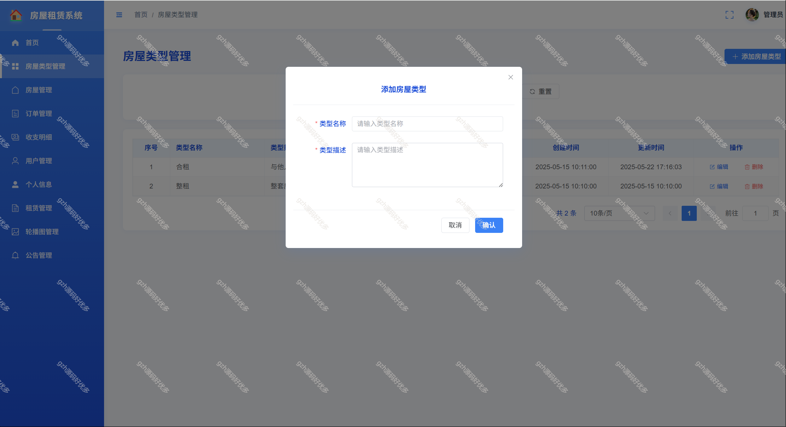
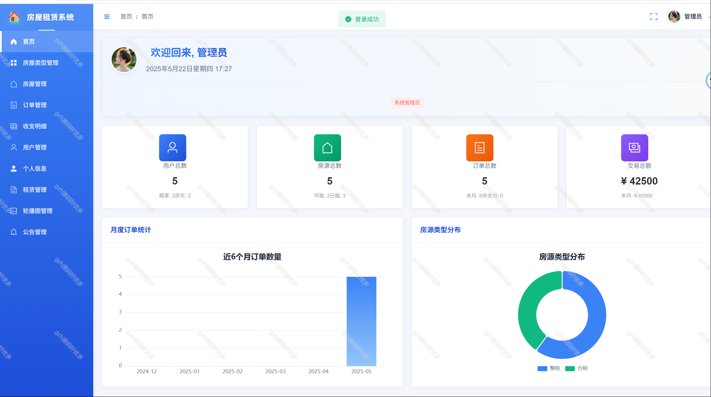
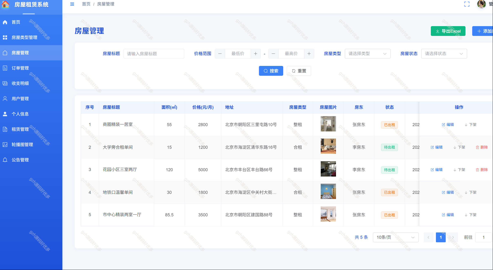
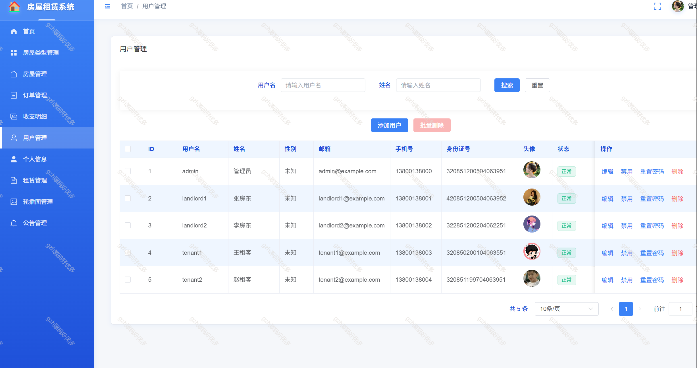
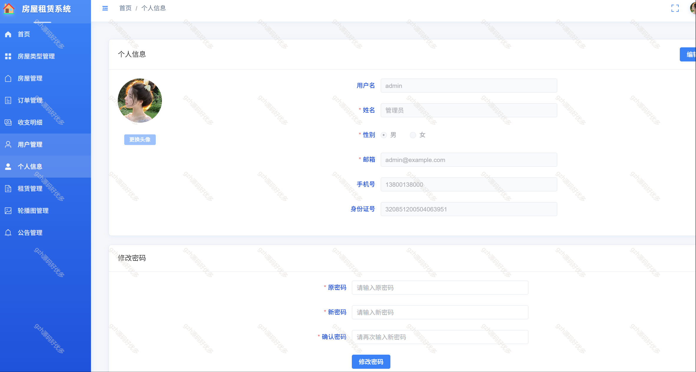
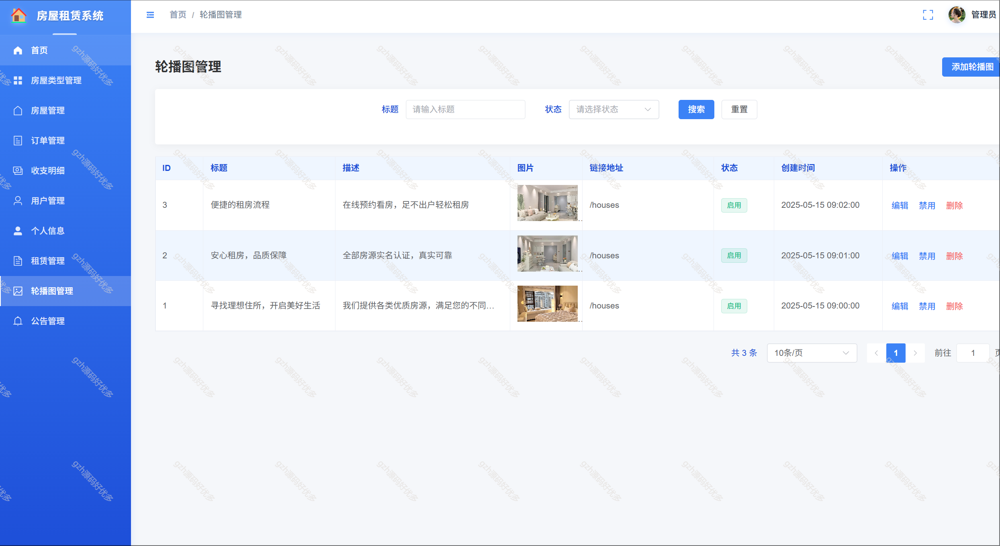
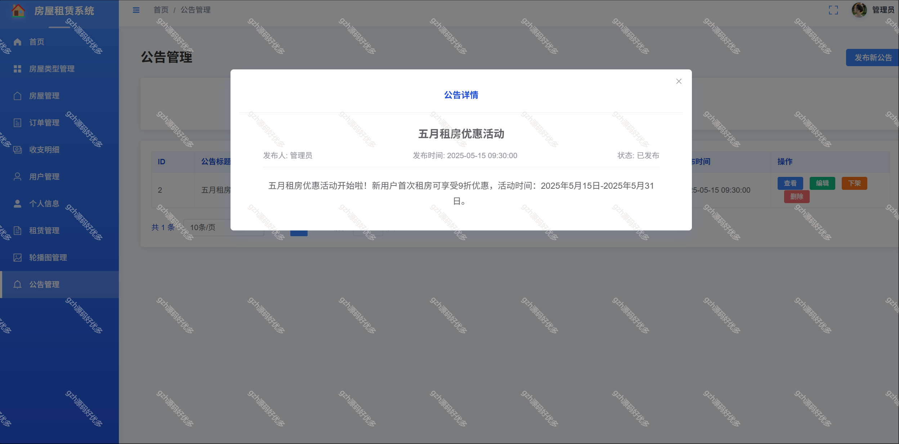

# springbootA363
springbootA363房屋租赁出租系统
 
## 查看主页获取源码

### 一、作品包含

源码+数据库+全套环境和工具资源+部署教程

### 二、项目技术

前端技术：Vue3、Element Plus、Axios
数据库：MySQL
后端技术：SpringBoot3、Spring Security、MyBatis-Plus

  

### 三、运行环境

开发工具：IDEA/eclipse  + vscode

数据库：MySQL8.0+

数据库管理工具：Navicat10以上版本

环境配置软件： JDK17 + Maven3.6.3

前端Nodejs：16+

浏览器：谷歌浏览器

### 四、项目介绍
项目编号：springbootA363

本系统是一个基于SpringBoot3和Vue3开发的房屋租赁平台，旨在为房东、租客和管理员提供便捷的房屋租赁服务。系统将实现房屋管理、订单管理、用户管理等核心功能，满足不同角色的业务需求。

#### 1. 用户管理模块
- 用户注册与登录
- 用户信息管理
- 用户角色管理(管理员、房东、租客)
- 密码修改

#### 2. 房屋管理模块
- 房屋基本信息管理(添加、修改、删除)
- 房屋类型管理(合租/整租)
- 房屋图片上传
- 房屋状态管理(待出租、已出租、下架等)

#### 3. 订单管理模块
- 订单创建
- 订单状态管理(待支付、已支付、已取消等)
- 合同管理(生成、查看、下载、打印)

#### 4. 新闻公告模块
- 公告发布、修改、删除
- 公告查看

#### 5. 收支明细模块
- 租金收入记录
- 退款记录
- 收支统计

#### 6. 租赁记录模块
- 租赁历史记录查询
- 租赁记录统计分析
- 租赁状态跟踪
- 租赁评价管理

### 五、运行截图

  
